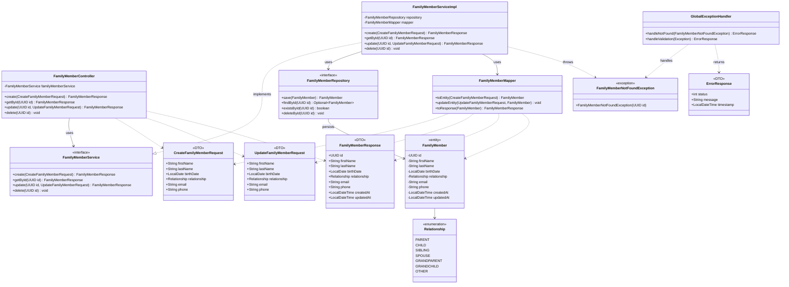

# service-family: UML Class Diagram

```mermaid
classDiagram
    direction TB

    class FamilyMemberController {
        -FamilyMemberService familyMemberService
        +create(CreateFamilyMemberRequest) FamilyMemberResponse
        +getById(UUID id) FamilyMemberResponse
        +update(UUID id, UpdateFamilyMemberRequest) FamilyMemberResponse
        +delete(UUID id) void
    }
    class FamilyMemberService {
        <<interface>>
        +create(CreateFamilyMemberRequest) FamilyMemberResponse
        +getById(UUID id) FamilyMemberResponse
        +update(UUID id, UpdateFamilyMemberRequest) FamilyMemberResponse
        +delete(UUID id) void
    }

    class FamilyMemberServiceImpl {
        -FamilyMemberRepository repository
        -FamilyMemberMapper mapper
        +create(CreateFamilyMemberRequest) FamilyMemberResponse
        +getById(UUID id) FamilyMemberResponse
        +update(UUID id, UpdateFamilyMemberRequest) FamilyMemberResponse
        +delete(UUID id) void
    }
    class FamilyMemberRepository {
        <<interface>>
        +save(FamilyMember) FamilyMember
        +findById(UUID id) Optional~FamilyMember~
        +existsById(UUID id) boolean
        +deleteById(UUID id) void
    }

    class FamilyMemberMapper {
        +toEntity(CreateFamilyMemberRequest) FamilyMember
        +updateEntity(UpdateFamilyMemberRequest, FamilyMember) void
        +toResponse(FamilyMember) FamilyMemberResponse
    }

    class FamilyMember {
        <<entity>>
        -UUID id
        -String firstName
        -String lastName
        -LocalDate birthDate
        -Relationship relationship
        -String email
        -String phone
        -LocalDateTime createdAt
        -LocalDateTime updatedAt
    }
    class Relationship {
        <<enumeration>>
        PARENT
        CHILD
        SIBLING
        SPOUSE
        GRANDPARENT
        GRANDCHILD
        OTHER
    }

    class CreateFamilyMemberRequest {
        <<DTO>>
        +String firstName
        +String lastName
        +LocalDate birthDate
        +Relationship relationship
        +String email
        +String phone
    }

    class UpdateFamilyMemberRequest {
        <<DTO>>
        +String firstName
        +String lastName
        +LocalDate birthDate
        +Relationship relationship
        +String email
        +String phone
    }

    class FamilyMemberResponse {
        <<DTO>>
        +UUID id
        +String firstName
        +String lastName
        +LocalDate birthDate
        +Relationship relationship
        +String email
        +String phone
        +LocalDateTime createdAt
        +LocalDateTime updatedAt
    }

    class FamilyMemberNotFoundException {
        <<exception>>
        +FamilyMemberNotFoundException(UUID id)
    }

    class GlobalExceptionHandler {
        +handleNotFound(FamilyMemberNotFoundException) ErrorResponse
        +handleValidation(Exception) ErrorResponse
    }

    class ErrorResponse {
        <<DTO>>
        +int status
        +String message
        +LocalDateTime timestamp
    }

    FamilyMemberController --> FamilyMemberService : uses
    FamilyMemberServiceImpl ..|> FamilyMemberService : implements
    FamilyMemberServiceImpl --> FamilyMemberRepository : uses
    FamilyMemberServiceImpl --> FamilyMemberMapper : uses
    FamilyMemberServiceImpl ..> FamilyMemberNotFoundException : throws
    FamilyMemberRepository --> FamilyMember : persists
    FamilyMember --> Relationship
    FamilyMemberMapper ..> CreateFamilyMemberRequest
    FamilyMemberMapper ..> UpdateFamilyMemberRequest
    FamilyMemberMapper ..> FamilyMemberResponse
    FamilyMemberMapper ..> FamilyMember
    FamilyMemberController ..> CreateFamilyMemberRequest
    FamilyMemberController ..> UpdateFamilyMemberRequest
    FamilyMemberController ..> FamilyMemberResponse
    GlobalExceptionHandler ..> FamilyMemberNotFoundException : handles
    GlobalExceptionHandler ..> ErrorResponse : returns
```

